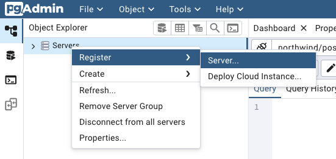

# SQL and Docker Project
I created this little project to put into practice some of the content and tools I've been studying, and the main objectives were:
- Create some SQL queries to answer some fictitious business questions
- Use Docker to create a PostgreSQL database without the need to install PostgreSQL + pgAdmin locally

The analyses provided here can be applied to companies of all sizes that want to become more analytical. Through these reports, organizations can extract valuable insights from their data, helping them to make strategic decisions.

## Database Context
The Northwind database contains the sales data of a company called Northwind Traders, which imports and exports specialty foods from all over the world.

The Northwind database is sourced from the company's ERP, containing customer, order, inventory, purchasing, supplier, shipping, employee and accounting data.

There are a total of 14 tables and the relationships between the tables are shown in the following entity relationship diagram:


## Business Problems & Queries

1. What was the total revenue in 1997?
```sql
WITH dim_orders AS (
	SELECT DISTINCT 
		order_id
	FROM 
		orders
	WHERE 
		EXTRACT(YEAR FROM order_date) = 1997
), 
dim_total AS (
	SELECT 
		od.order_id, 
		SUM(od.unit_price * od.quantity) AS total,
		SUM((od.unit_price) * od.quantity * (1.0 - od.discount)) AS total_w_discount
	FROM 
		order_details AS od
	INNER JOIN 
		dim_orders AS o
			ON 
                od.order_id = o.order_id
	GROUP BY 
        1
)
SELECT 
	1997 AS year_reference, 
	SUM(total) AS total_revenue, 
	SUM(total_w_discount) AS total_revenue_w_discount
FROM 
	dim_total
GROUP BY 
    1;
```
2. Do a monthly revenue growth analysis per year and YTD revenue calculation
```sql
WITH dim_mth_rev AS (
	SELECT 
		EXTRACT(YEAR FROM o.order_date) AS year_ref,
		EXTRACT(MONTH FROM o.order_date) AS mth_ref, 
		SUM((od.unit_price) * od.quantity * (1.0 - od.discount)) AS revenue_w_discount
	FROM 
		orders AS o 
	INNER JOIN 
		order_details AS od
			ON 
                o.order_id = od.order_id
	GROUP BY 
        1, 2
),
dim_rev_ytd AS (
	SELECT
		year_ref, 
		mth_ref, 
		revenue_w_discount,
		SUM(revenue_w_discount) OVER (PARTITION BY year_ref ORDER BY mth_ref) AS revenue_ytd
	FROM 
		dim_mth_rev
), 
dim_rev_calc AS (
	SELECT 
		year_ref, 
		mth_ref,
		revenue_w_discount,
		LAG(revenue_w_discount) OVER (PARTITION BY year_ref ORDER BY mth_ref) AS previous_revenue,
		revenue_ytd
	FROM
		dim_rev_ytd
)
SELECT year_ref,
	mth_ref,
	revenue_w_discount,
	revenue_w_discount - previous_revenue AS rev_abs_diff, 
	(revenue_w_discount - previous_revenue) / previous_revenue * 100 AS rev_pct_diff,
	revenue_ytd
FROM 
	dim_rev_calc
ORDER BY 
    1, 2;
```

3. What is the total amount each customer has spent so far?
```sql
SELECT
	cus.company_name,
	SUM((od.unit_price) * od.quantity * (1.0 - od.discount)) AS total_revenue_w_discount
FROM
	customers AS cus
JOIN 
	orders AS o
	ON
		cus.customer_id = o.customer_id
JOIN 
	order_details AS od
	ON
		o.order_id = od.order_id
GROUP BY
	1
ORDER BY 
	2 DESC;
```

4. Separate the customers into 5 groups according to the amount spent per customer
```sql
WITH dim_customers AS (
	SELECT
		cus.company_name,
		SUM((od.unit_price) * od.quantity * (1.0 - od.discount)) AS total_revenue_w_discount
	FROM
		customers AS cus
	JOIN 
		orders AS o
		ON
			cus.customer_id = o.customer_id
	JOIN 
		order_details AS od
		ON
			o.order_id = od.order_id
	GROUP BY
		1
)
SELECT 
	company_name,
	total_revenue_w_discount, 
	NTILE(5) OVER(ORDER BY total_revenue_w_discount DESC) AS group_cluster
FROM 
	dim_customers
ORDER BY
	2 DESC;
```

5. Which UK customers spent more than 1000 dollars?
```sql
WITH dim_customers AS (
	SELECT
		cus.country,
		cus.company_name,
		SUM((od.unit_price) * od.quantity * (1.0 - od.discount)) AS total_revenue_w_discount
	FROM
		customers AS cus
	JOIN 
		orders AS o
		ON
			cus.customer_id = o.customer_id
	JOIN 
		order_details AS od
		ON
			o.order_id = od.order_id
	GROUP BY
		1, 2
)
SELECT
	country,
	company_name,
	total_revenue_w_discount
FROM
	dim_customers
WHERE
	country = 'UK'
	AND
		total_revenue_w_discount >= 1000;
```

6. Identify the 10 best-selling products.
```sql
SELECT
	p.product_name,
	SUM((od.unit_price) * od.quantity * (1.0 - od.discount)) AS total_revenue_w_discount
FROM
	products AS p
JOIN
	order_details AS od
	ON
		p.product_id = od.product_id
GROUP BY
	1
ORDER BY
	2 DESC
LIMIT
	10;
```

## Docker Setup

**Prerequisite**: Install Docker and Docker Compose

* [Get Started with Docker](https://www.docker.com/get-started)
* [Install Docker Compose](https://docs.docker.com/compose/install/)

### Step by Step

1. **Launch Docker Compose** in a terminal, run the command below to launch the services:
    
    ```
    docker-compose up
    ```
    
    Wait for the configuration messages, such as:
    
    ```csharp
    Creating network "northwind_psql_db" with driver "bridge"
    Creating volume "northwind_psql_db" with default driver
    Creating volume "northwind_psql_pgadmin" with default driver
    Creating pgadmin ... done
    Creating db      ... done
    ```
       
2. **Launch PgAdmin** Access pgAdmin via the URL [http://localhost:5050](http://localhost:5050), using the password `postgres`. 

Set up a new server in pgAdmin:



    **General**:
        * Name: db
    **Connection**:
        * Host name: db
        * Username: postgres
        * Password: postgres 
        
Then select the ```northwind``` database, ```public``` schema, and all the 14 tables will be available to run the queries.

## Conclusion
Having the script that creates the Northwind database (```northwind.sql```) and using Docker to avoid having to download the necessary software locally, I was able to use pgAdmin to access a PostgreSQL database. 

With access to the database, using basic and advanced SQL commands I was able to answer the questions and business problems proposed, transforming raw data into information for the company. 

## References
The initial idea of this project is part of the SQL Bootcamp from [Jornada de Dados](https://suajornadadedados.com.br/).

The repository used as reference for this project can be found [here](https://github.com/lvgalvao/Northwind-SQL-Analytics/tree/main).
